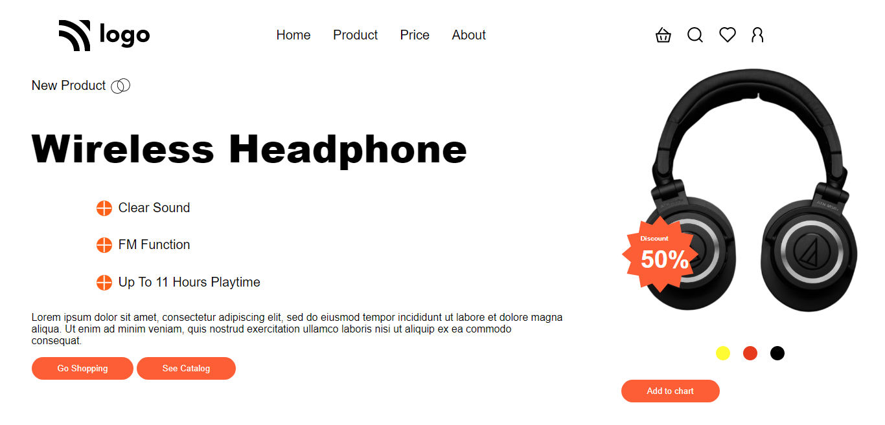

## ⭐ Product Home Page | Anup Maurya ⭐

This Page is built using **HTML5 and CSS3**.

 
 

## 📌 **Live Site URL:** <a href="">**Visit Now** 🚀</a>

 

## 📌 Tech Stack

&nbsp;
&nbsp;
 
 

## 📌 Overview

 

## 📌 My process

- I joined a bootcamp **"JavaScript Full Stack Web Developer Bootcamp"** by **iNeuron**.<a href="https://ineuron.ai/one-neuron/Tech-Neuron?campaign=affiliate&coupon_code=TZMHQCDB"> **Check🚀**</a>
- This project is given to us as an assignment.
- It took me about **4 hours** to complete this project.

## 📌 What I Learn

👉 Learned how to position elements with help of css.

👉 Also learned how to use z-index property.

## 📬 Connect With Me

- **LinkedIn** - [Anup Kumar Maurya](https://www.linkedin.com/in/anupmaurya/)
- **Instagran** - [@theanupmaurya](https://www.instagram.com/theanupmaurya)

